# Angular
A JavaScript framework for building client-side applications using HTML, CSS and JavaScript.

## Why Angular?
### Expressive HTML
It powers up our HTML with features such as if conditions, for loops, and local variables.
### Powerful Data Binding
We can easily display fields from our data model, track changes, and process updates from the user.
### Modular By Design
Our applications become a set of building blocks, making it easier to create and reuse content.
### Built-in Back-End Integration
Support for communication with a back-end service. This makes it easy for our web applications to integrate with a back-end service, to get and post data, or execute server-side business logic.

## Anatomy of an Angular Application

### Application
An application is comprised of a set of components and services that provide functionality across those components.
<p align="center">
  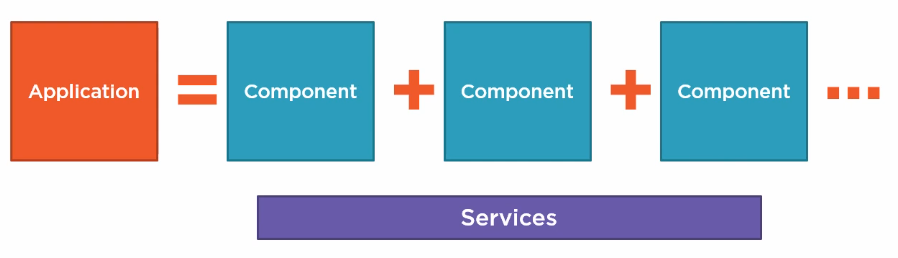
</p>

### Component
Each component is comprised of:
<p align="center">
  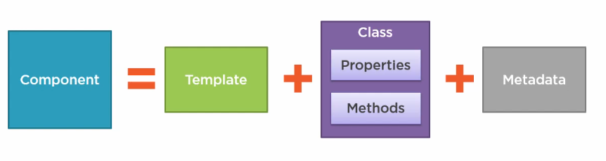
</p>

#### Template
Which is the HTML for the user interface fragment defining a view for the application.
* View layout.
* Created with HTML.
* Includes binding and directives
#### Class
The code associated with the view. The class contains the properties or data elements available for use in the view, and methods which perform actions for the view.
* Code supporting the view.
* Created with TypeScript.
* Properties: data.
* Methods: logic.
#### Metadata
Which provides additional information about the component to Angular. It's a metadata that identifies the class as an Angular component.
* Extra data for Angular.
* Defined with a decorator.
#### Decorator
A function that adds metadata to a class, its members, or its method arguments. Prefixed with an @. Angular provides built-in decorators.
> @Component()

### Modules
Help us organize our application into cohesive blocks of functionality and provide boundaries within our application.
<p align="center">
  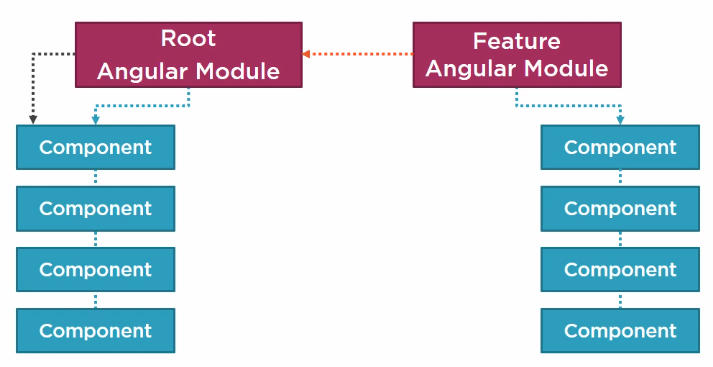
</p>

```typescript
import { NgModule } from '@angular/core';
import { BrowserModule } from '@angular/platform-browser';
import { AppComponent } from './app.component';


@NgModule({
  // declarations: We define which of our components belong to this module.
  declarations: [AppComponent],
  // imports: We define the external modules that we want to hace available to all of the components that belong to this module.
  imports: [BrowserModule],
  // bootstrap: Define the startup component of the application.
  bootstrap: [AppComponent]
})
export class AppModule { }

```

### Directives
Custom HTML element or attribute used to power up and extend our HTML.

## Bindings
Coordinates communication between the component's class and its template and often involves passing data.

<p align="center">
  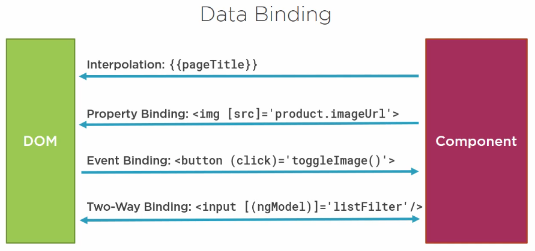
</p>

### Interpolation
Is a one-way binding from the class property to the template.
```html
<p>{{title}}</p>


```

### Property Binding
One-way binding. Allow us to set a property of an element to the value of a template expression. Our binding target is always [].
```html

```

### Event Binding
Event binding allows you to listen for certain events such as keystrokes, mouse movements, clicks, and touches.

Angular event binding syntax consists of a target event name within parentheses on the left of an equal sign, and a quoted template statement on the right.
```html
<button (click)="onSave($event)">Save</button>
```

### Two-way binding
The two-way binding syntax is a great convenience compared to separate property and event bindings. It would be convenient to use two-way binding with HTML form elements like **input** and **select**.

The NgModel directive allows you to display a data property and update that property when the user makes changes.

Before using the ngModel directive in a two-way data binding, you must import the FormsModule and add it to the NgModule's imports list.

Here's an example:
```html
<label for="example-ngModel">[(ngModel)]:</label>
<input [(ngModel)]="currentItem.name" id="example-ngModel">
```

## Pipes
<p align="center">
  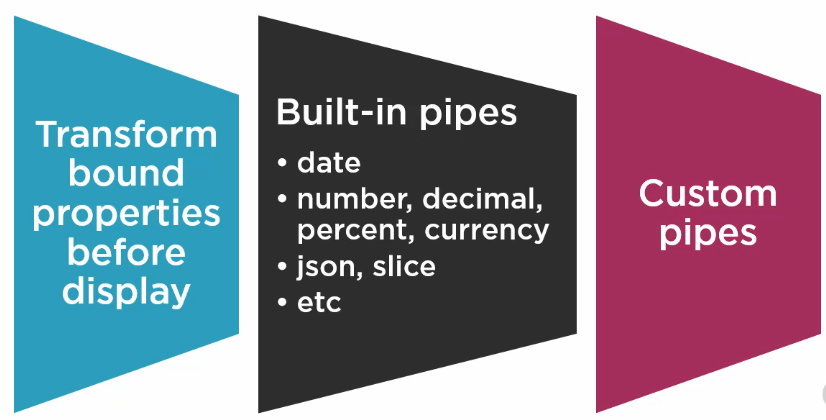
</p>

```html
<td>{{ product.productCode | lowercase }}</td>
<td>{{ product.price | currency:'USD':'symbol':'1.2-2' }}</td>
```

### Custom Pipes
```typescript
import { Pipe, PipeTransform } from '@angular/core';

@Pipe({
  name: 'convertToSpaces',
})
export class ConvertToSpacesPipe implements PipeTransform {
  transform(value: string, character: string): string {
    return value.replace(character, ' ');
  }
}
```
```html
...
<td>{{ product.productCode | lowercase | convertToSpaces: '-' }}</td>
...
```

## Interface
A **specification** identifying a related set of properties and methods.

A class commits to supporting the specification by **implementing** the interface.

Use the interface as a **data type**.

Development time only.

```typescript
export interface IProduct {
  productId: number;
  productName: string;
  productCode: string;
  releaseDate: string;
  price: number;
  description: string;
  starRating: number;
  imageUrl: string;
}
```

## Component Lifecycle
A component has a lifecycle managed by Angular. Angular creates the component, renders it, creates ans renders its children, process changes when its data bound properties change, and then destroys it before removing its template from the DOM.
<p align="center">
  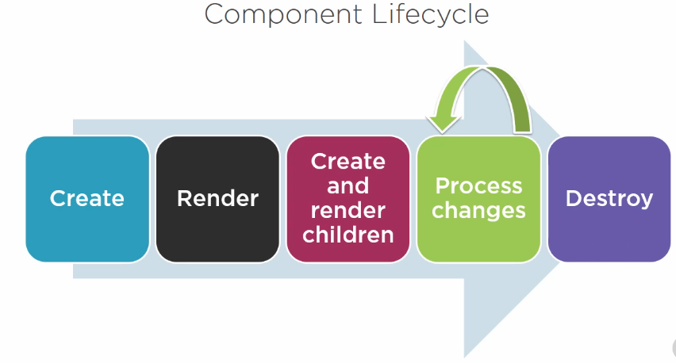
</p>

### Component Lifecycle Hooks

#### OnInit
Perform any component initialization after Angular has initialized the data bound properties. This is a good place to retrieve the data for the template from back-end service.

#### OnChanges
Perform any action after Angular sets data bound input properties.

#### OnDestroy
Perform any cleanup before Angular destroys the component.

## Services
A class with a focus purpose. We often create a service to implement functionality that is independent from any particular component, to share data or logic across components, or encapsulate external interactions such as data access.
There are two ways that our component can work with this service. The component can create an instance of the service class and use it. That simple, and it works, but the instance is local to the component, so we can't share data or other resources, and it will be more difficult to mock the service for testing. Alternatively, we can register the service with Angular. Angular then creates a single instance of the service class, called a singleton, and holds onto it. Specifically, Angular provides a built-in injector. We register our services with the Angular injector, which maintains a container of created service instances.

 If our component needs a service, the component class defines the service as a dependency. The Angular injector then provides, or injects, the services class instance when the component class is instantiated. This process is called dependency injection. Since Angular manages the single instance, any data or logic in that instance is shared by all of the classes that use it. This technique is the recommended way to use services because it provides better management of service instances, it allows sharing of data and other resources, and it's easier to mock the services for testing purposes.

### Dependency injection
A coding pattern in which a class receives the instances of objects it needs, called its dependencies, from an external source rather than creating them itself. In Angular, this external source is the Angular injector.

### Registering a Service
We register the service with the Angular injector, and the injector provides the service instance to any component that injects it using the constructor. The injector represented here is the root application injector. But wait, there's more. In addition to the root application injector, Angular has an injector for each component mirroring the component tree. A service registered with the root application injector is available to any component or other service in the application. A service registered with a specific component is only available to that component and its child or nested components.

For example, if a service is registered with the ProductList component's injector, the service is only available for injection in the product-list component and its child, the star component.

#### When should you register your service with the root injector versus a component injector?
Registering a service with the root injector ensures that the service is available throughout the application. In most scenarios, you'll register the service with the root injector. If you register a service with a component injector, the service is only available to that component and its child or nested components. This isolates a service that is used by only one component and its children, and it provides multiple instances of the service for multiple instances of the component.

#### How do we register a service?
That depends on which injector we use. We register the service with the root application injector in the service. We pass an object into the Injectable decorator and set the providedIn property to root. We can then access this service from any component or other service in the application.
```typescript
import { Injectable } from '@angular/core';

@Injectable({
  providedIn: 'root',
})
export class ProductService { }
```
Register service for one component
```typescript
import { Component } from '@angular/core';

@Component({
  selector: 'app-product-list',
  templateUrl: './product-list.component.html',
  styleUrls: ['./product-list.component.scss'],
  providers: [ProductService]
})

export class ProductListComponent { }
```

#### How do we do dependency injection in TypeScript?
The answer is in the constructor. Every class has a constructor that is executed when an instance of the class is created. If there is no explicit constructor defined for the class, an implicit constructor is used, but if we want to inject dependencies, such as an instance of a service, we need an explicit constructor. In TypeScript, a constructor is defined with a constructor function.

#### What type of code normally goes into the constructor function?
As little as possible. Since the constructor function is executed when the component is created, it is primarily used for initialization and not for code that has side effects or takes time to execute. We identify our dependencies by specifying them as parameters to the constructor function, like this.
```typescript
import { ProductService } from 'src/app/services/product.service';

@Component({
  selector: 'app-product-list',
  templateUrl: './product-list.component.html'
})

export class ProductListComponent {
  private _productService;
  constructor(productService: ProductService) {
    this._productService = productService;
  }
}
```
Here we define a private variable to hold the injected service instance. We create another variable as the constructor parameter. When this class is constructed, the Angular injector sets this parameter to the injected instance of the requested service. We then assign the injected service instance to our local variable. We can then use this variable anywhere in our class to access service properties or methods.
```typescript
import { ProductService } from 'src/app/services/product.service';

@Component({
  selector: 'app-product-list',
  templateUrl: './product-list.component.html'
})

export class ProductListComponent {
  constructor(private productService: ProductService) { }
}
```
This is such a common pattern that TypeScript defined a shorthand syntax for all of this code. We simply add the accessor keyword, such as private here, to the constructor parameter. Then this is a shortcut for declaring this variable, defining a parameter, and setting the variable to the parameter. Neat. You'll see this technique used throughout the Angular documentation and other code examples.

## Observables
Reactive extensions represent a data sequence as an observable sequence, commonly just called an observable. Observables help us manage asynchronous data, such as data coming from a back-end service. Observable treat events as a collection. We can think of an observable as an array whose items arrive asynchronously over time. A method in our code can subscribe to an observable to receive asynchronous notifications as new data arrives. The method can then react as data is pushed to it. The method is notified when there is no more data or when an error occurs. Observables are used within Angular itself, including Angular's event system and its HTTP client service.

### Operators
 Observables allow us to manipulate sets of events with operators. Operators are methods on observables that compose new observables. Each operator transforms the source observable in some way. Operators do not wait for all of the values and process them at once. Rather, operators on observables process each value as it is emitted. Some examples of operators include map, filter, take, and merge.
 ```typescript
 import { Observable, range } from 'rxjs';
 import { map, filter } from 'rxjs/operators';

const source$: Observable<number> = range(0, 10);

source$.pipe(
  map(x => x * 3),
  filter(x => x % 2 === 0)
).subscribe(x => console.log(x));
)
 ```
 The source emits 0, the 0 is multiplied by 3, resulting in 0. The 0 is divided by 2 with a remainder of 0, so it is included in the final result. The source then emits 1. The 1 is multiplied by 3, resulting in 3. The 3 is divided by 2 with a remainder of 1, so it is not included in the final result, and so on.

 ### Subscribing to Observable
 Observables are lazy. Just like a newspaper or a newsletter, an observable doesn't emit values until we subscribe. So when we are ready to start receiving values in our component, we call subscribe. The subscribed method takes an optional argument, which is an observer object. As its name suggests, the observer object observes the stream and responds to three types of notifications, next, error, and complete. The first handler function is often called a next function because it processes the next emitted value. Since observables can handle multiple values over time, the next function is called for each value the observable emits. The second is an error handler function, it executes if there is an error. In some cases we want to know when the observable completes, so observables provide a third handler that is executed on completion. The third function is rarely used when working with HTTP requests since they automatically complete after emitting the single response, and we aren't using the return value here, so we have not provided an option for the user to cancel the request.

 The subscribe function returns a subscription. We use that subscription to call unsubscribe and cancel the subscription if needed.

 ### Observables vs Promises
 Observables are different from promises in several ways. A promise returns a single future value, an observable emits multiple asynchronous values over time. A promise is not lazy. By the time you have a promise, it's on its way to being resolved. An observable is lazy by default. Observables will not emit values until they are subscribed to. A promise is not cancelable, it is resolved or rejected, and only once. An observable can be canceled by unsubscribing, plus an observable supports map, filter, reduce, and similar operators.

 ### Exception Handling
 There are many things that can go wrong when communicating with a back-end service, everything from an invalid requests to a lost connection. There are two key observable operators that we'll need.
 #### Tap
 Taps into the observable stream and allows us to look at the emitted values in the stream without transforming the stream. So tap is great to use for debugging or logging.
 #### CatchError
 Catches any error.
 ```typescript
 ...
 import { httpClient, HttpErrorResponse } from '@angular/common/http';
 import { Observable } from 'rxjs';
 import { catchError, tap } from 'rxjs/operators';
 ...
 getProduct(): Observable<IProduct[]> {
   return this.http.get<IProduct[]>(this.productUrl).pipe(
     tap(data => console.log('All: ', JSON.stringify(data))),
     catchError(this.handleError)
   );
 }

 private handleError(err: HttpErrorResponse){
   ...
 }
 ```
To use these operators we access the pipe method of the observable. We then pass in the operators, separated by commas. Here the tap operator logs the retrieved data to the console. That way we can verify it's been retrieved correctly, and the catchError operator takes in an error handling method. The error handling method gets one parameter, the error response object. In the error handling method, we can handleError as appropriate. We can send the error information to a remote logging infrastructure or throw an error to the calling code.

## Routing
An Angular application is a single-page application. That means all of our views are displayed within one page, normally defined in the index.html file, so each of the 5, 10, or hundreds of views take turns appearing on that one page. How do we manage which view to display when? That's the purpose of routing. We configure a route for each component that wants to display its view on the page. As part of our application design, we provide a menu, a toolbar, buttons, images, or data links that allow the user to select the view to display. We tie a route to each option or action. When the user selects the option or performs the action, the associated route is activated. Activating a component's route displays that component's view.

### Configuring Routes
Angular provides a RouterModule in the angular/router package that registers the router service provider. In addition to registering the service provider, the RouterModule also declares the router directives. In the last clip we mentioned two router directives, router-link and router-outlet. By importing the RouterModule, our component templates can use these or any other router directives. RouterModule also exposes the routes we configure. Before we can navigate to a route, we need to ensure that the routes are available to the application. We do this by passing the routes to RouterModule, like this. We call the RouterModule's forRoot method and pass our array of routes to that method. This establishes the routes for the root of our application.

The router must be configured with a list of route definitions. Each definition specifies a route object. Each route requires a path. The path property defines the URL path segment for the route. When this route is activated, this URL path segment is appended to the URL of our application. The user can type in or bookmark the resulting URL to return directly to the associated component's view. In most cases, we also specify a component, which is the component associated with the route. It is this component's template that is displayed when the route is activated.
```typescript
[
  { path: 'products', component: ProductListComponent },
  { path: 'products/:id', component: ProductDetailComponent },
  { path: 'home', component: HomeComponent },
  { path: '', redirectTo: 'home', pathMatch: 'full' },
  { path: '**', component: PageNotFoundComponent }
]
```
These are all examples of route definitions.
* The first route simply maps a specific URL path segment to a specific component. So this URL displays the template from the product-list component.
* The :id in the second route represents a route parameter. The product detail page displays the detail for one product, so it needs to know which product to display. The ProductDetailComponent reads the ID from this path segment and displays the defined product. We can define any number of parameters here, separated with slashes.
* The fourth route defines a default route. The redirect here translates the empty route to the desired default path segment. A redirect route requires a pathMatch property to tell the router how to match the URL path segment to the path of a route. We only want this default route when the entire client-side portion of the path is empty, so we set the pathMatch to full.
* The asterisks in the last route denote a wildcard path. The router matches this route if the requested URL doesn't match any prior paths defined in the configuration. This is useful for displaying a 404 not found page or redirecting to another route.
A few things to note here. There are no leading slashes in our path segments, and the order of the routes in this array matters. The router uses a first match win strategy when matching the routes. This means that more specific routes should always be before less specific routes, such as the wildcard route.

### Passing Parameters to a Route
```html
<td>
  <a [routerLink]="['/products', product.productId]">
    {{product.productName}}
  </a>
</td>
```
The first element of the array is the string path of the route. The second element of the array is the value for the route parameter. When the router composes the URL, it uses this array element to construct the defined parameter.

### Reading Parameters from a Route
To get the parameter from the URL, we use the ActivatedRoute service provided by the router. We want an instance of this service, so we define it as a dependency in our constructor. This line of code defines a private variable called route and assigns it to the instance of the ActivatedRoute provided by the Angular service injector. Then we use the instance of the ActivatedRoute service to get the desired parameter.
```typescript
import { ActivatedRoute } from '@angular/router';

constructor(private route: ActivatedRoute) {
  console.log(this.route.snapshot.paramMap.get('id'));
}
```
There are two different ways to get the parameter. We could use a snapshot or we could use an observable. Use the snapshot approach if you only need to get the initial value of the parameter. In our example, the user is always returned to the list page before navigating to another product, so the snapshot approach would be sufficient.

If you expect the parameter to change without leaving the page, use an observable. For example, if we had a Next button on the Product Detail page to display the next product, the URL will change to the next product's ID, so you'd want to use an observable instead. We use the ActivatedRoute snapshot method here and access the appropriate parameter from its parameter array. The string specified here must match the name of the parameter from the path.

### Activating a Route with Code
We want  navigates back to the Product List page. We could activate this route using the RouterLink directive in the component template. But it's also possible to route with code.
```typescript
import { Router } from '@angular/router';

constructor(private router: Router) { }

onBack(): void {
  this.router.navigate(['/products']);
}
```
When would you want to navigate with code instead of the routerLink directive in a template? One example is a save button where you need to execute some code to save the data and then route.

### Protecting Routes with Guards
There may be times that we want to limit access to a route. We want routes only accessible to specific users, such as an administrator for example, or we want the user to confirm a navigation operation, such as asking whether to save before navigating away from an edit page. For that, we use guards. The Angular router provides several guards:
#### CanActivate
Guard navigation to a route.

The canActivate method has two parameters, the ActivatedRouteSnapshot to provide current route information, and the RouterStateSnapshot to provide router state information. The method can return an observable, a promise, or a simple Boolean value.
#### CanDeactivate
Guard navigation away from the current route.
#### Resolve
Pre-fetch data before activating a route.
#### CanLoad
Prevent asynchronous routing.

### Building a Guard
You can use the same techniques we're covering here to implement any other type of route guard. We'll build a guard that prevents navigation to the route unless a specific condition is true. Building a guard clause follows the common pattern used throughout Angular. Create a class, add a decorator, and import what we need.
```typescript
import { Injectable } from '@angular/core';
import { CanActivate } from '@angular/router';

@Injectable({
  providedIn: 'root',
})
export class ProductDetailGuard implements CanActivate {

  canActivate(): boolean {
    ...
  }
}
```
Here, we define a guard class. Since we are implementing this guard as a service, we use the Injectable decorator. This class implements CanActivate. To create one of the other kinds of guards, change this to implement one of the other guard types. We then implement the canActivate method. For simple cases, this method can return a Boolean value, true to activate the route and false to cancel the route activation. For more complex cases, we could return an observable or a promise from this method.
```typescript
[
  { path: 'products', component: ProductListComponent },
  { path: 'products/:id', canActivate: [ProductDetailGuard], component: ProductDetailComponent },
  { path: 'home', component: HomeComponent },
  { path: '', redirectTo: 'home', pathMatch: 'full' },
  { path: '**', component: PageNotFoundComponent }
]
```
Using a guard is simple. We build the guard to protect the product-detail route, so we add the guard to the product-detail route. We add canActivate and set it to an array containing the guards to execute before this route is activated.

## Modules
<p align="center">
  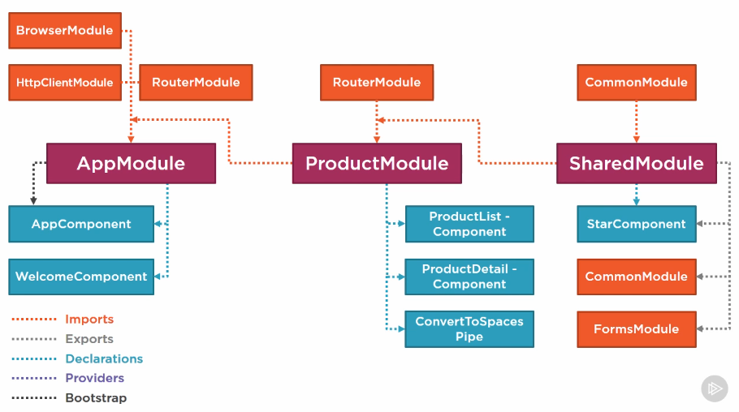
</p>

### What is an Angular Module?
An Angular module is a class with an NgModule decorator. **Its purpose?** To organize the pieces of our application, arrange them into cohesive blocks of functionality, and extend our application with capabilities from external libraries. Angular modules provide the environment for resolving the directives and pipes in our component's templates. And module are a great way to selectively aggregate classes from other modules and reexport them in a consolidated convenience module. BrowserModule, HttpModule, and RouterModule are all examples of this. An Angular module can be loaded eagerly when the application starts, or it can be lazy loaded asynchronously by the router.

### How does Angular Module organize our Application?
* An Angular module declares each component, directive, and pipe that it manages. Every component, directive, and pipe we create belongs to an Angular module.
* An Angular module bootstraps are route application component, defining the component needed to display our first template.
* An Angular module can export components, directives, pipes, and even other Angular modules, making them available for other modules to import and use.
* An Angular module imports other Angular modules. This brings in the exported functionality from those imported modules.
* An Angular module can register service providers with the Angular injector, making the services available to any class in the application.
<p align="center">
  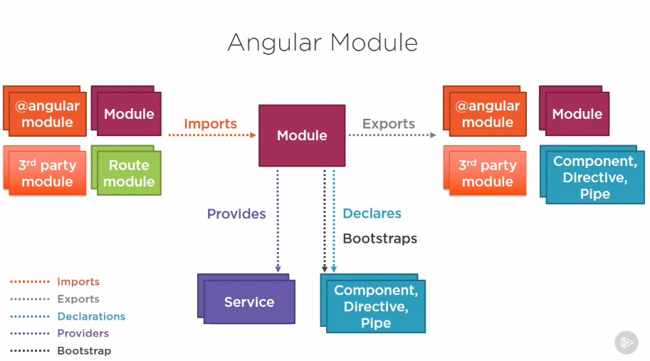
</p>
We can think of an Angular module as a box. Inside that box we declare each of our components. If those components need any functionality, that functionality also needs to be defined within this box. The app component sets up the routing for our main menu using routerLink and includes the router-outlet directive, so it needs the routing directives, router-service and routes, which are defined in RouterModule. The ProductListComponent uses ngModel, so it needs the FormsModule. The ProductListComponent also uses ngFor and NgIf, so it needs the BrowserModule. The ProductListComponent uses the pipe, so it needs that too. The ProductListComponent also uses the starRating component's directive, so it needs that as well, and so on until the box contains everything that each of our components needs.
<p align="center">
  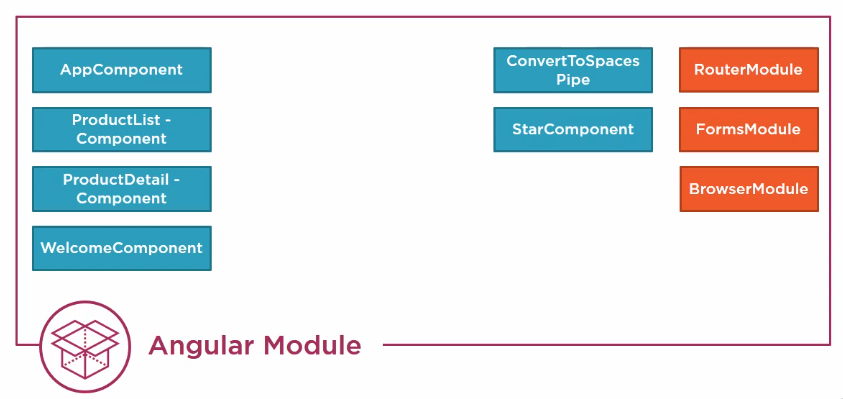
</p>
Saying this another way, for each component that belongs to an Angular module, that Angular module provides the environment for template resolution. The module defines which set of components, directives, and pipes are available to the component's template. Each declared component's template is resolved using only the capabilities provided within that module.

### Bootstrap Array
Every Angular application has at least one Angular module called the root application module, or AppModule, and an Angular application has at least one component called the root application component, or AppComponent. The AppModule bootstraps the AppComponent to provide the directive used in the index.html file. The bootstrap array of the NgModule decorator defines the component that is the starting point of the application. This is the component that is loaded when the application is launched.

Here are some things to keep in mind when using the bootstrap array.

> Every application must bootstrap at least one component, the root application component.

We do this by simply adding the root application component to the bootstrap array of the root application module. The bootstrap array should only be used in the root application module, AppModule. As we build other Angular modules, we won't use the bootstrap array.

### Declarations Array
Every component, directive, and pipe we create is declared by an Angular module. We use the declarations array of the NgModule decorator to define the components, directives, and pipes that belong to this Angular module. Here are some things to keep in mind when using the declarations array.

> Every component, directive, and pipe we create has to belong to one and only one Angular module.

It would be better to divide the components into multiple modules, with basic application pieces in the AppModule and feature pieces in appropriate feature modules. As we separate out our pieces, it is important to remember that each component, directive, and pipe belongs to one and only one Angular module.

> Only declare components, directives, and pipes.

Don't add other class, services or modules to the declarations array.

> Never re-declare components, directives or pipes that belong to another module.

This is a corollary to truth number one. If we re-declare, then the component, directive or pipe no longer belongs to one and only one Angular module. We should only declare components, directives, and pipes that belong to this module.

> All declared components, directives, and pipes are private by default.
> They're only accessible to other components, directives, and pipes declared in the same module.

So if we declare the X component in Module B, by default that component is not available to components in other Angular modules. We share components, directives, and pipes by exporting them.

> The Angular module provides the template resolution environment for its component's templates.

When we include a component in the declarations array of an Angular module, the component belongs to that Angular module. That component's template, directives, and pipes are then resolved within that module. When we use a directive in a component's template, Angular looks to the module for the definition of that directive. If the component defining that directive is not declared within the same Angular module or exported from an imported module, Angular won't find the directive and will generate an error.

### Exports Array
The exports array of the NgModule decorator allows us to share an Angular module's components, directives, and pipes with other modules. We can export any of this module's components, directives, and pipes so they can be pulled in when another module imports this module. We can also reexport system Angular modules, such as FormsModule and HttpModule. We can reexport third-party modules such as Material Design. And we can reexport our own modules. Here are some things to keep in mind when using the exports array.

> Export any component, directive or pipe if another component needs it.

A module can export any of its declared components, directives or pipes.

> Reexport modules to reexport their components, directives, and pipes.

This is useful when consolidating features from multiple modules to build a convenience or a shared module. We can reexport something without importing it first. An Angular module only needs to import the components, directives, and pipes that are required by the components declared in the module. But the Angular module can still provide capabilities to other modules that import it by reexporting.

Example, a SharedModule exports the FormsModule, even though it did not import it. So any module that imports the SharedModule will have access to the ngModel and other forms directives.

> Never export a service.

Services added to the providers array of an Angular module are registered with the root application injector, making them available for injection into any class in the application. So there is no point in exporting them. They are already shared throughout the application.

### Imports Array
An Angular module can be extended by importing capabilities from other Angular modules. The imports array of the NgModule decorator allows us to import supporting modules that export components, directives or pipes. We then use those exported components, directives, and pipes within the templates of components that are declared in this module. Many Angular system libraries are Angular modules, such as the FormsModule and HttpModule. We can import Angular modules to use their capabilities. Many third-party libraries are also Angular modules, such as Material Design. We can import third-party Angular modules to use their capabilities. We can import our own modules to extend our application with additional features or share capabilities across several modules. We'll see that in an upcoming demo. And we could separate out our route configurations into its own module or set of modules and import that.
<p align="center">
  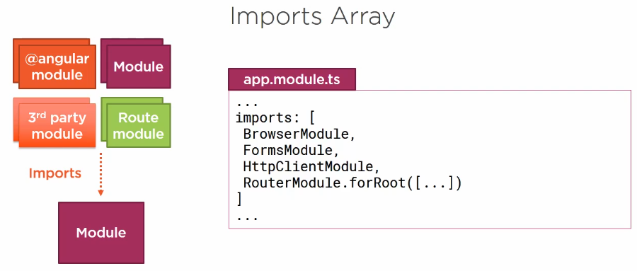
</p>

Here are some things to keep in mind when using the imports array.

> Importing a module makes available **any exported** components, directives, and pipes from that module.

The ngModel directive is exported in the FormsModule. By importing the FormsModule into our AppModule, we can use ngModel in any component declared in our AppModule.

> Only import what this module needs.

Only import modules whose exported components, directives or pipes are needed by this module's component templates. Don't import anything this module does not need.

> Importing a module does not provide access to its imported modules.

<p align="center">
  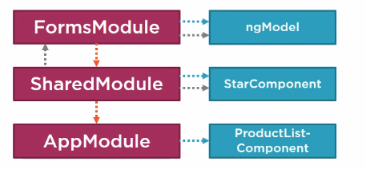
</p>
Here we have AppModule, which declares the product ProductListComponent, and a SharedModule that declares and exports the StarComponent. AppModule imports the SharedModule so the SharedModule's exports are available to the AppModule's component templates. This means that the ProductListComponent can use the star-component directive. If the SharedModule imports FormsModule, then the FormsModule's exports are available to the SharedModule. And the StarComponent could use the ngModel directive. But the FormsModule exports are not available to the AppModule, so the ProductListComponent could not use the ngModel directive. I've heard this rule also stated another way. Imports are not inherited. Note, however, that if the SharedModule reexported the FormsModule, then the FormsModule exports are available to the AppModule, and the ProductListComponent could use the ngModel directive. So when thinking about the relationship between modules, think of a module more as a box than as a tree structure.

### Providers Array
Angular modules can also register service providers for our application. However, this is no longer recommended preface. Starting with Angular version 6, the recommended way to register service providers for our application is to use the providedIn property of the service itself, not the providers array of the Angular module. Because you may see older code, use the providers array to register services. I'll still cover it.
<p align="center">
  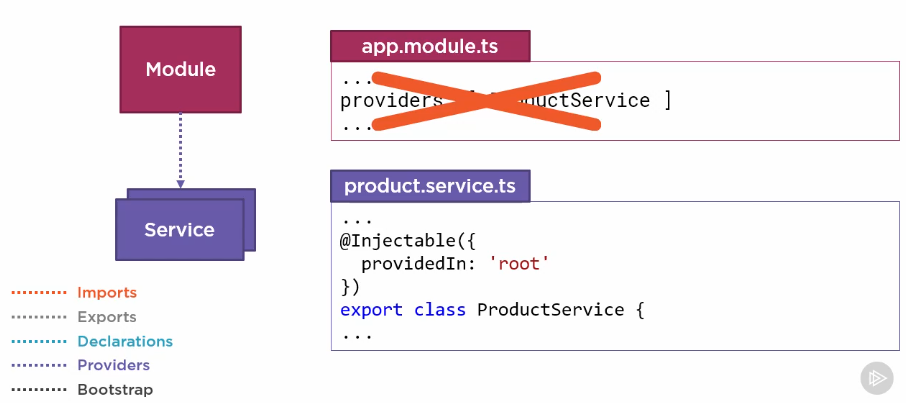
</p>

Here are some things to keep in mind when using the NgModule providers array.

> Any service provider added to the providers array is registered at the root of the application.

So the service is available to be injected into any class in the application. Say for example we have a feature module called ProductModule. We add the product service to the providers array of this module. At first glance, we may think we have encapsulated the product service into the ProductModule, but that is not the case. Any service provider added to the providers array is registered at the root of the application and is available to any class, even classes in other feature modules. So if we want to ensure a particular service is encapsulated and only accessible within a specific component or set of components, add the service provider to the providers array of an appropriate component instead of an Angular module.
Note that this is not the case for lazy loaded services. See the Angular documentation for more information on lazy loading.

> Don't add services to the providers array of a SharedModule.
> Consider building a core module for services and importing it once in the AppModule

As discussed in the Services and Dependency Injection course module. There should only be only one instance of a service that is an application-wide singleton, so a service should not be included in the providers array for any module that is meant to be shared. Instead, consider building a core module for services and importing it once in the AppModule. This will help ensure that the services are only registered one time. We can even add code to the code module's constructor to ensure that it is never imported a second time. See the Angular documentation for details.

### Features Module
We created the root application module, AppModule. It declares all of our components and our pipe. It imports the system Angular modules that our components need. But this is getting a little unwieldy. We have no separation of responsibilities. Here we are mixing our basic application features, such as the home component, with our product features, such as the product components, with our shared features, such as the star component. As we add more feature sets to this application, such as customer management, invoicing, and so on, this is only going to get harder to manage, so let's reorganize and refactor to break this into multiple Angular modules. The first thing we want to do is extract some of these pieces into feature sets. We can then create a feature module for each feature set. Using feature modules helps us partition our application into logical groupings with separate concerns. Our first step is to define a new feature module. Creating a feature module involves defining a new module file, **ProductModule** in this example, and reorganizing the pieces of the application so that all of the associated feature pieces and everything they need are here in this module. In the declarations array of the feature module, we add the appropriate components that provide the features for the application.

In this example, we add the ProductListComponent and ProductDetailComponent. Then as we did with the box example at the beginning of this course module, we start to look at what each component needs. In this example, the ProductListComponent uses the pipe, so we need that, and both the product list and product detail components use the star component, so we'll need that here as well. But that's not enough. The ProductListComponent uses ngModel and ngFor, and both components use ngIf and routing. How do we get that? We import these needed capabilities from other Angular modules. Our product components use routing, so we import the system router module.

So, do we pull in the system BrowserModule? Nope. The BrowserModule should only be imported into the root application module, AppModule.

### Shared Module
The purpose of a shared module is to organize a set of commonly used pieces into one module and export those pieces so they are available to any module that imports the shared module. This allows us to selectively aggregate our reusable components and any external modules and reexport them in a consolidated convenience module. Creating a shared module involves defining a new module file,  and reorganizing the pieces of the application so that the shared pieces are here in this module. First, we add the components, directives, and pipes that we want to share throughout our application to the declarations array. Then we add to the imports array anything that this shared component needs. We don't import FormsModule because we don't need it here. If our star component did use two-way binding or we added another component here that did, we'd need to import FormsModule as well.

We then need to export everything that we want to share. The exports array defines what this Angular module shares with any module that imports it. We export the StarComponent. That way it is available to the components and any module that imports the SharedModule. We reexport the CommonModule and FormsModule so their directives and other features are available to any module that imports the SharedModule. And notice here that we can export something without importing it first.

To use the SharedModule, we import it into every feature module that needs the shared capabilities, such as our ProductModule.
<p align="center">
  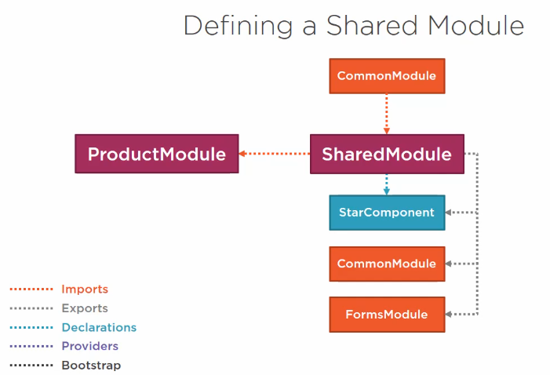
</p>

### App Module
We now know that every application has a root application module, that is, by convention, called AppModule. The main purpose of the AppModule is to orchestrate the application as a whole. And now that we've removed the feature and shared pieces from this module, its purpose is easier to see. Let's take another look. We've reduced the code in AppModule such that it now fits on one page. The AppModule normally imports BrowserModule. This is the module that every browser application must import. BrowserModule registers critical application service providers. It also imports and exports CommonModule, which declares and exports directives such as ngIf and ngFor. These directives are then available to any of the AppModule's component templates. We also import HttpModule to register the Angular HttpClient service provider. We import RouterModule and call forRoot, passing in the configured routes for the root of the application. Then we import each feature module. The declarations array identifies the list of components that belong to this module. The bootstrap array identifies the root component, AppComponent, as the bootstrap component. When Angular launches the application, it loads this component and displays its template.
<p align="center">
  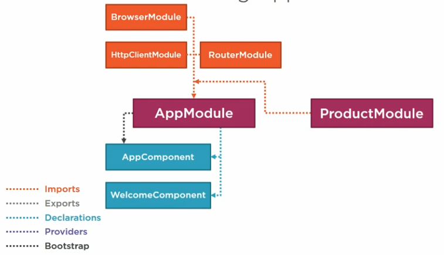
</p>

### Summary
<p align="center">
  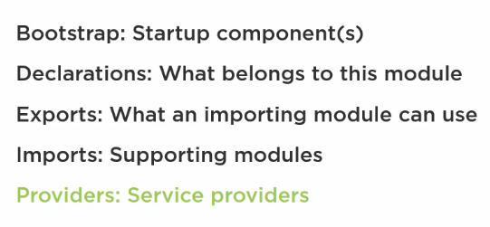
</p>
When creating an Angular module, we build a class and decorate it with the NgModule decorator. The NgModule metadata includes:
* The bootstrap array for defining the list of startup components. In many cases, there is only one, the root component of the application.
* The declarations array declares which components, directives, and pipes belong to this module.
* The exports array identifies the list of components, directives, and pipes that an importing module can use.
* The imports array lists supporting modules. These modules provide components, directives, and pipes needed by the components in this module.
* The providers array lists the service providers. Angular registers each provider with Angular's root application injector, so these services are available to be injected into any class in the application.

## Notes

### Filtering
We can filter our list of elements is to use a pipe. However, Angular doesn't come with a built-in pipe to provide filtering or sorting. Angular doesn't offer such pipes because they perform poorly and prevent aggresive minification. The Angular documentation and the Angular team and many experienced Angular developers strongly recommend moving filtering and sorting logic into the component itself.

### Selectors
The selector property is only required if the component will be nested within another component.

## Basic Features
* Progressive Web Apps
* Lazy Loading
* RxJS
* Forms
* Fully Featured Router
* Animations

## Advanced Features
* Server-Side Rendering
* Mobile
* Angular Language Service

## Tips & Tricks
* Use the CLI.
* Follow the style guide.
* Do sorting & filtering in your component.
* Learn & use Typescript.
* Learn & use NgRx.
* Learn Webpack.
* Use Lazy Loading.
* Don't touch the DOM directly.
* Understand what you're sending down to the browser.
* Use immutable or observable data to maximize performance where appropiate.
